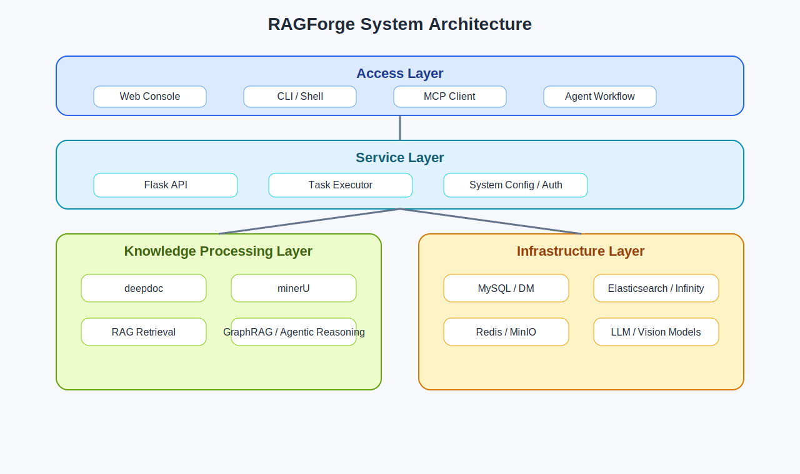
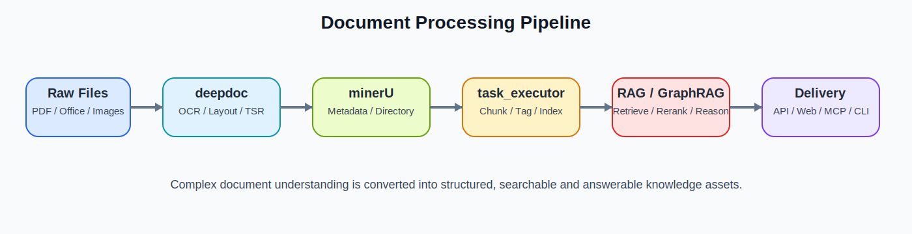

# INIS 技术文档总览


## 中英文名称
- 中文名称：RAGForge 智能知识增强平台
- English Name: RAGForge Intelligent Knowledge Augmentation Platform

## 一句话介绍
RAGForge 是一个面向复杂文档理解、知识库构建、检索增强生成、图谱推理和可视化运营管理的一体化平台。

## 项目概览
本项目采用多模块单仓库结构，把后端 API、RAG 核心链路、文档解析、GraphRAG、MCP 接入、前端控制台、测试资产和部署编排统一在同一代码库中。它的目标不是只做一个问答接口，而是提供从“文档进入系统”到“结构化解析、索引构建、召回增强、答案生成、流程编排、运维交付”的完整工程闭环。

## 项目成果
- 形成了完整的多模块技术底座：`api`、`rag`、`deepdoc`、`minerU`、`graphrag`、`web`、`docker`、`mcp` 等模块职责清晰，已具备独立演进能力。
- 打通了复杂文档处理主链路：支持 PDF、Office、图片等输入，并能在 OCR、布局识别、表格结构识别、元数据抽取之后进入统一 RAG 流程。
- 具备知识库化交付能力：后端支持知识库、文件、文档、分块、对话、系统配置、用户与批量任务管理。
- 实现了图谱增强能力：可从文本中抽取实体与关系，进一步支持社区分析、图嵌入、多跳关系增强检索。
- 具备智能体和协议化扩展能力：既支持 Agent DSL，也支持通过 MCP 暴露工具，方便接入外部智能体生态。
- 形成了前后端与运维一体化交付模式：支持本地源码开发、容器编排部署、开发与生产模式切换。

## 架构示意图


### 图片说明
上图展示了平台的分层结构。最上层是 Web 控制台、CLI 与 MCP Client 等访问入口；中间层是 Flask API 与任务调度；下层是文档解析、RAG、GraphRAG 与 Agent 能力；最底层则是数据库、搜索引擎、缓存、对象存储和模型服务。这个结构说明项目不是单点工具，而是一个具备平台化特征的知识增强系统。

## 文档处理流程图


### 图片说明
该流程图强调了项目最有价值的一条主线：原始文档进入系统后，先经过 `deepdoc` 与 `minerU` 做视觉理解和结构提取，再由 `rag/svr/task_executor.py` 完成任务消费、分块构建、标签抽取和索引写入，最终由检索与问答层对外提供知识服务。这也是项目与普通聊天应用相比更有工程深度的部分。

## 目录
- `src/agent.md`：图式工作流与 Agent DSL
- `src/agentic_reasoning.md`：多步检索式推理
- `src/api.md`：后端 API 与服务编排入口
- `src/conf.md`：运行配置与映射定义
- `src/deepdoc.md`：深度文档理解与视觉解析
- `src/docker.md`：容器化部署与环境编排
- `src/driver.md`：模型下载与初始化引导
- `src/graphrag.md`：图谱抽取、社区分析与图检索
- `src/mcp.md`：MCP 服务器与客户端对接
- `src/minerU.md`：文档结构提取与视觉增强解析
- `src/rag.md`：RAG 核心处理链路
- `src/ragforge-shell.md`：命令行子模块摘要
- `src/tests.md`：测试资产与验证脚本
- `src/tools.md`：运维与数据迁移脚本
- `src/web.md`：前端控制台

## 模块总表
| 模块 | 主要职责 | 关键价值 |
| --- | --- | --- |
| `api` | 提供后端接口、鉴权、任务状态、业务编排 | 把所有核心能力以服务方式对外开放 |
| `rag` | 分块、检索、重排、答案生成、任务执行 | 形成平台知识增强主链路 |
| `deepdoc` | OCR、布局识别、表结构识别 | 解决复杂文档的高质量输入问题 |
| `minerU` | 元数据、目录、视觉增强解析 | 提高结构化提取质量 |
| `graphrag` | 实体关系抽取、社区报告、图检索 | 让检索具备结构化推理能力 |
| `agent` | DSL 化工作流与智能体编排 | 支持复杂业务流程建模 |
| `agentic_reasoning` | 多轮检索式推理 | 适合多跳问答和深度研究场景 |
| `mcp` | MCP 工具对接 | 方便外部智能体直接接入 |
| `web` | 前端控制台 | 提供可运营、可管理的界面层 |
| `docker` | 容器编排与交付 | 降低部署门槛并支持多环境 |
| `tests` | 回归验证与示例脚本 | 提高变更可靠性 |
| `tools` | 迁移、运维、辅助脚本 | 支撑交付、排障与批处理 |

### 表格说明
这张表适合快速向管理层或新加入成员解释“每个目录为什么存在”。它不只是代码路径列表，而是项目能力边界说明表。

## 配置
### 核心配置位置
| 配置类别 | 主要文件 | 说明 |
| --- | --- | --- |
| 服务主配置 | `conf/service_conf.yaml` | 后端连接数据库、搜索、缓存、对象存储、模型服务的核心入口 |
| 模型工厂 | `conf/llm_factories.json` | 管理模型提供方与接入方式 |
| 文档解析 | `conf/magic-pdf.json` | 控制 PDF 与文档结构解析所需配置 |
| 索引映射 | `conf/mapping.json`、`conf/infinity_mapping.json` | 定义索引结构和字段布局 |
| 前端配置 | `web/.umirc.ts`、`web/src/conf.json`、`web/.env` | 控制 Umi、接口地址和运行环境 |
| 容器配置 | `docker-compose*.yml`、`docker/.env` | 管理容器、端口、依赖服务与模式切换 |

### 配置说明
- Python 侧和 Web 侧配置边界清晰，适合多人协作和多环境治理。
- 配置项较多，建议把“模板文件”和“真实环境值”分开管理。
- 所有主机地址、账户名、密码、证书、Token、API Key 都应替换为环境专属值。

## 核心特色
- 单仓库完成“解析、索引、检索、推理、运营、部署”全链路交付。
- 同时支持文本型 RAG、视觉文档理解、知识图谱增强和智能体编排。
- 既能作为业务平台运行，也能以 API、CLI、MCP 的形式对外输出能力。
- 支持复杂文档类型，不局限于纯文本输入。
- 支持前后端分离开发与 Docker 化部署。

## 工具概览
| 技术域 | 采用技术 | 作用说明 |
| --- | --- | --- |
| 后端 | Python 3.10+、Flask、Peewee、Trio | 提供 API、服务编排、数据库访问与异步任务能力 |
| 前端 | React 18、Umi 4、TypeScript、Ant Design | 构建管理控制台与交互页面 |
| 检索 | Elasticsearch、Infinity、向量与关键词检索 | 支撑多路召回与混合检索 |
| 解析 | OCR、版面识别、表结构识别、PDF/Office 解析 | 把复杂文档转为可检索内容 |
| 图谱 | GraphRAG、实体关系抽取、社区分析 | 解决多实体和多跳问题 |
| 运维 | Docker Compose、Nginx、辅助脚本 | 支撑本地部署和环境交付 |

### 表格说明
这张表强调的是“工程工具如何服务业务能力”，适合放在汇报材料、交付文档或技术方案说明中。

## 技术亮点
| 技术亮点 | 说明 |
| --- | --- |
| 服务启动与维护 | `api/ragforge_server.py` 负责服务启动、数据库初始化、后台进度更新和周期维护 |
| 解析任务主引擎 | `rag/svr/task_executor.py` 负责消费任务、构建分块、打标签、触发 GraphRAG 联动 |
| 双路文档理解 | `deepdoc/` 与 `minerU/` 共同处理复杂文档视觉理解和结构化解析 |
| 图谱增强检索 | `graphrag/` 将实体、关系、社区报告和图检索纳入统一问答流程 |
| 多入口交付 | `web/`、`mcp/`、CLI 子模块共同构成平台、协议和命令行三种输出方式 |

## 快速开始
```bash
# 1. 安装 Python 依赖
uv sync --python 3.10 --all-extras

# 2. 启动基础依赖
docker compose -f docker/docker-compose-base.yml up -d

# 3. 启动后端
export PYTHONPATH=$(pwd)
python api/ragforge_server.py

# 4. 启动前端
cd web
npm install
npm run dev
```

## 本地部署
### 方式一：源码开发
```bash
uv sync --python 3.10 --all-extras
docker compose -f docker/docker-compose-base.yml up -d
export PYTHONPATH=$(pwd)
python api/ragforge_server.py
cd web
npm install
npm run dev
```

### 方式二：Docker 编排
```bash
cd docker
./start.sh
```

### 本地部署说明
| 部署方式 | 适用场景 | 特点 |
| --- | --- | --- |
| 源码开发模式 | 开发、调试、联调 | 便于单模块快速修改与热更新 |
| Docker 编排模式 | 演示、集成测试、近生产验证 | 环境更完整，依赖更接近真实运行状态 |

## 适用场景
- 企业知识库构建与问答。
- 报告、期刊、会议纪要、册本、论文等复杂文档处理。
- 面向多来源文档的结构化抽取和统一索引。
- 需要图谱增强、多步推理和流程编排的知识服务场景。

## 交付物清单
| 交付物 | 位置 | 说明 |
| --- | --- | --- |
| 总览文档 | `READM.md` | 面向项目整体介绍、汇报和交接 |
| 模块说明 | `src/*.md` | 面向每个顶层目录的技术总结 |
| 配图资源 | `assets/` | 用于总览文档展示的图片与示意图 |

## 安全与脱敏说明
- 文档内容基于代码结构、README、入口文件和配置形态整理而成。
- 已避免写入真实个人邮箱、用户标识、固定口令、真实 API Key、私网地址和环境专属凭据。
- 如果后续继续扩充案例、截图或运维脚本说明，应保持同样的脱敏标准。

## 许可证
项目采用 Apache License 2.0。
